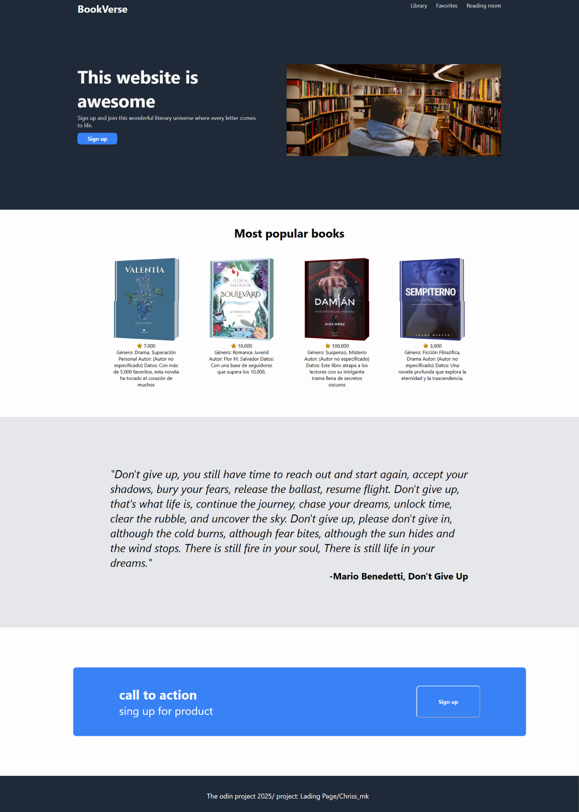

# LandingPage / BookVerse

# 📚 Virtual Library
The Virtual Library is a web platform designed to explore, visualize, and manage a wide collection of books, with a fully customizable environment (like having your own virtual campus). The project focuses on providing a seamless experience for both end users and administrators.

# 🚀 Key Features:

Book exploration with images and detailed descriptions.
User registration and login.
Search functionality for book titles.

# 🎯 Project Objectives:

Create an intuitive and visually appealing user experience.
Allow developers to easily extend functionality.
Maintain clean, well-documented, and scalable code.
Responsive design for both mobile and desktop devices.
